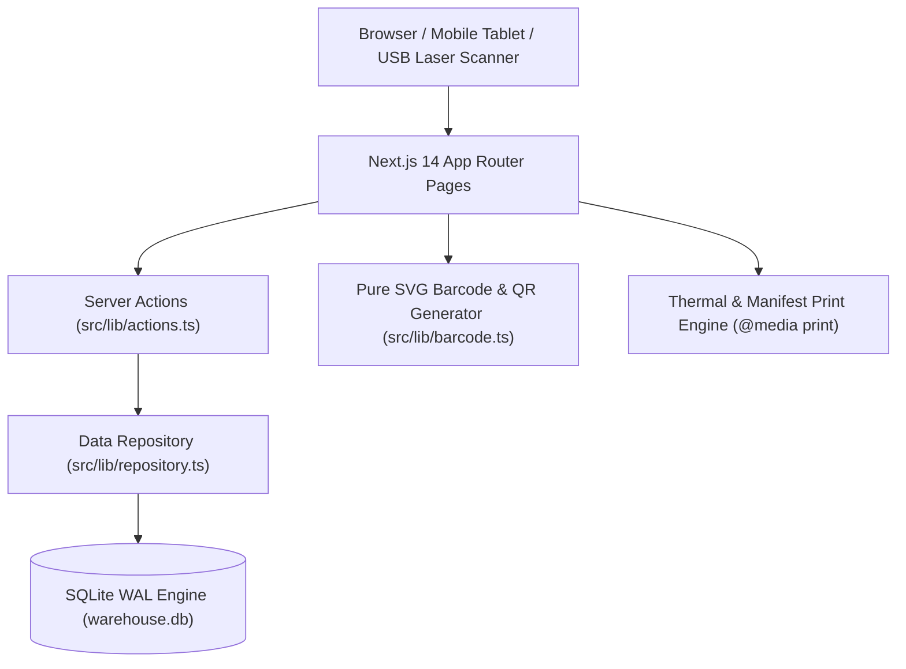

# OmniFlow WMS — Modern Warehouse Management System

A production-grade, light-theme **Enterprise Warehouse Management System (WMS)** built with **Next.js 14**, **TypeScript**, **Tailwind CSS**, and **SQLite (better-sqlite3)**.

Designed with clean, human-crafted UI & UX principles—avoiding overly dark or flashy AI aesthetics in favor of crisp slate typography, accessible high-contrast tables, intuitive workflows, and direct print styling.

---

## 📖 1. Context & Design Philosophy

The primary objective of **OmniFlow WMS** is to deliver a realistic, high-performance warehouse operations platform with zero unnecessary visual noise:

- **Light-Mode Enterprise UI**: Clean `#f8fafc` backdrop with pure white `#ffffff` cards and subtle `#e2e8f0` borders. Dense, readable tables and sharp status badges make data scannable during fast-paced dock and warehouse floor operations.
- **Physical Workflow Alignment**: Tailored around real physical warehouse operations: Inbound PO receiving, Putaway bin assignment, Wave/Order picking, Pack validation, Physical Barcode/QR printing, and Dispatch.
- **Hardware Compatibility**: Native background keystroke interception for handheld USB laser barcode scanners without requiring third-party drivers.
- **Zero-Dependency Vector Barcodes**: Standalone SVG engine for Code 128 (1D) and 2D QR codes that print crisply to 4x2" thermal label rolls or standard A4 sheets.

---

## 🏗️ 2. Architecture & Data Flow



### Core Architecture Highlights:
- **Next.js 14 App Router**: Server-side rendered pages for rapid initial paint with React Server Actions for instant database mutations.
- **SQLite with WAL Mode**: Embedded database via `better-sqlite3` operating with Write-Ahead Logging (WAL) and foreign key constraints for fast, transactional local persistence.
- **Dedicated Print Styles**: `@media print` rules isolate thermal labels, picking packing slips, and receiving dockets when clicking **Print**.
- **Automated Seed Data**: Pre-loaded with 16 realistic SKUs across 8 categories, 4 storage zones with 60+ bin locations, active purchase orders, fulfillment orders, and a complete historical audit ledger.

---

## 🚀 3. Key Modules & Functional Overview

| Module | Route | Key Capabilities |
| :--- | :--- | :--- |
| **Operations Center** | `/` | Live KPI metrics (Total catalog, Inventory valuation $, Low-stock alerts), zone occupancy visualization, and real-time activity stream. |
| **Inventory SKU Catalog** | `/inventory` | Master SKU table, multi-column search, category filters, stock level progress (*Total, Reserved, Available*), stock adjustment modal with audit reason codes, bin transfer tool, printable barcode modal, and CSV export. |
| **Warehouse Map & Bin Matrix** | `/locations` | 2D interactive floor layout of Zone A, Zone B, Zone C, and Zone D. Bin inspector showing real-time stored SKUs, batch/lot numbers, and capacity limits. |
| **Inbound Freight (PO Receiving)** | `/inbound` | Purchase order creation, multi-line dock check-in verification, putaway bin allocation, and printable receiving dockets. |
| **Outbound Fulfillment (Dispatch)** | `/outbound` | Sales order fulfillment prioritized by urgency (*Urgent, High, Normal*), automated inventory reservation, guided wave/order picking with barcode checks, and printable packing slips/BOL. |
| **Barcode & QR Scanner Station** | `/scanner` | Hardware USB handheld barcode scanner auto-listener + camera reticle simulator + fast 1-click execution triggers (Add Stock, Pick, Relocate, Print). |
| **Partners Directory** | `/suppliers` | Supplier procurement directory (lead times, payment terms) and customer shipping account records. |
| **Immutable Audit Ledger** | `/movements` | Permanent, traceable record of all inbound receipts, picks, shipments, bin transfers, and cycle counts with CSV export. |

---

## 🎯 4. What You Can Expect & How to Use It

### Out-of-the-Box Functionality:
1. **Interactive Demo Data**: Explore receiving purchase orders, picking dispatch orders, moving inventory between storage bins, and adjusting stock quantities.
2. **Physical Barcode Scanning**: Connect any USB handheld barcode reader and scan barcodes or type SKU codes to trigger instant actions.
3. **Printable Documents**: Generate printable thermal sticker labels, inbound receiving dockets, and outbound packing slips with embedded barcodes.
4. **One-Click Demo Reset**: Reset the database to its pristine sample state at any time by clicking **"Reset Demo Data"** in the sidebar footer.

### How to Extend & Scale:
- **Mobile & Tablet Deployment**: The UI is responsive and touch-friendly for warehouse floor tablets and RF guns.
- **Database Migration**: To switch from local SQLite to PostgreSQL or MySQL, simply update the query adapters in `src/lib/db.ts` and `src/lib/repository.ts`.
- **ERP / eCommerce Sync**: Integrate external APIs (Shopify, WooCommerce, NetSuite, SAP) via Next.js API endpoints or Server Actions.

---

## 🛠️ Technology Stack

- **Framework**: [Next.js 14 (App Router)](https://nextjs.org)
- **Language**: [TypeScript](https://www.typescriptlang.org)
- **Styling**: [Tailwind CSS](https://tailwindcss.com) (Light Enterprise Palette)
- **Database**: [SQLite via better-sqlite3](https://github.com/WiseLibs/better-sqlite3) with WAL mode
- **Icons**: [Lucide React](https://lucide.dev)
- **Barcode & QR Engine**: Standalone Pure SVG Code-128 & QR generator

---

## 🏃 Running the Application

### Development Mode:
```bash
npm run dev
```
Open [http://localhost:3000](http://localhost:3000) in your browser.

### Production Build:
```bash
npm run build
npx next start -p 3000
```

### Reset Demo Data:
Click **"Reset Demo Data"** in the sidebar footer at any time to reseed realistic sample SKUs, locations, and orders.


